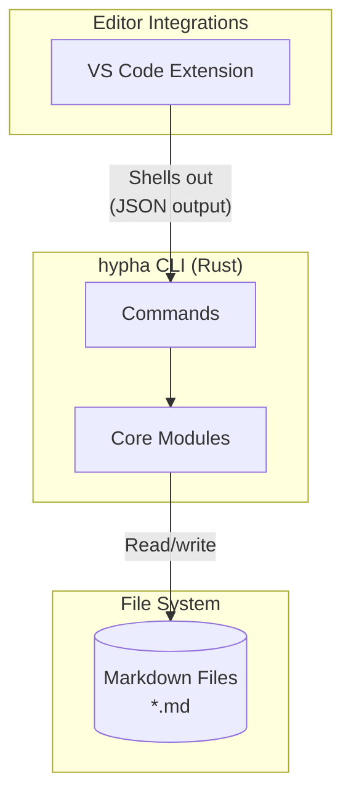
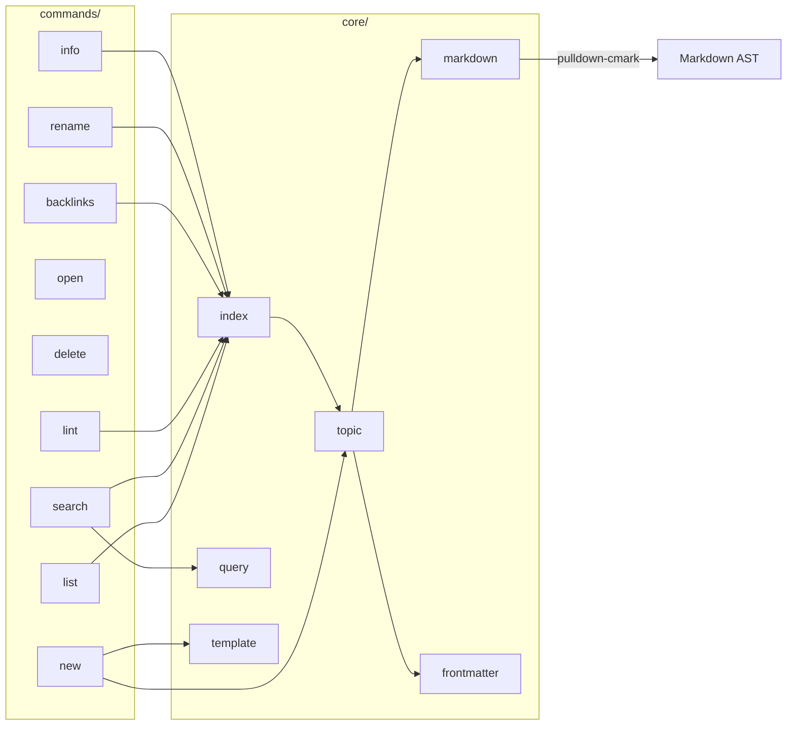
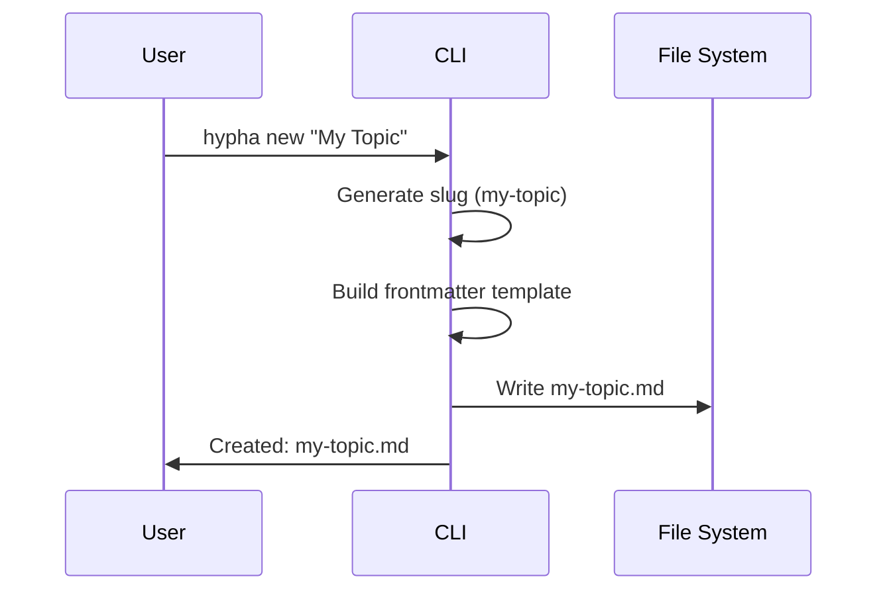
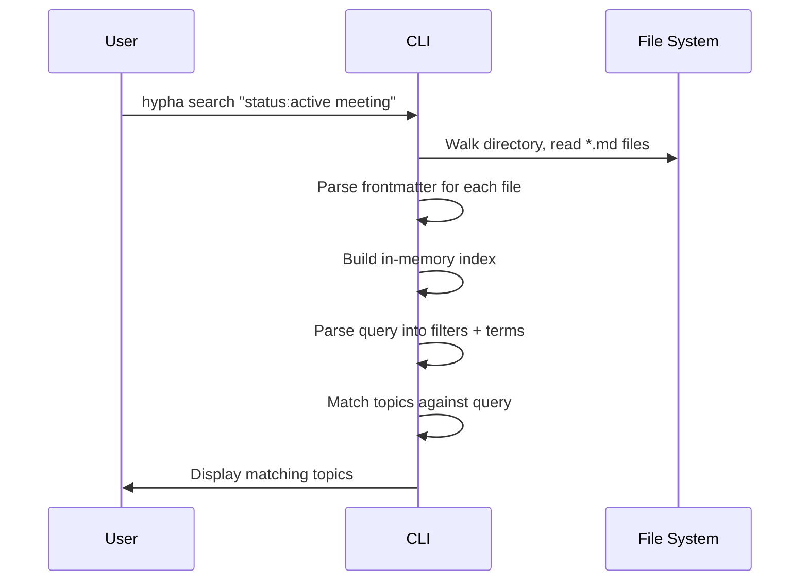
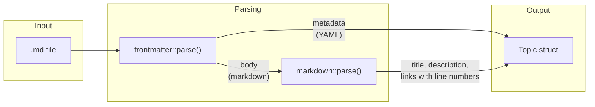

# Architecture Overview

Hypha follows a simple architecture where the CLI is the source of truth
and editor integrations are thin wrappers.

## System Diagram

## CLI Module Structure

## Component Responsibilities

### CLI (`cli/`)

The Rust binary handles all core logic:

- **commands/** - One file per CLI command (new, list, search, etc.)
- **core/** - Shared modules for indexing, parsing, and querying
- **main.rs** - Entry point with clap argument parsing

### VS Code Extension (`vscode/`)

Thin wrappers that:

1. Spawn the `hypha` binary with arguments
2. Parse the output
3. Present results in native UI

No business logic, just presentation.

## Data Flow

### Creating a Topic

### Searching Topics

### Parsing a Topic

The parser extracts:

- **Title**: First H1 heading
- **Description**: First paragraph after title
- **Links**: All local file links with line numbers (for lint)

## Design Principles

### 1. Files as Source of Truth

- All data lives in plain markdown files
- No database, no sync service, no lock-in
- Files are portable and version-controllable

### 2. CLI as Core Engine

- Single implementation of indexing/search logic
- Editor integrations are thin and interchangeable
- Easy to script and automate

### 3. Index on Demand

- No persistent index or daemon
- Re-index on every command (~50-200ms for typical usage)
- Simplicity over premature optimization

### 4. Extensible Frontmatter

- Only `title` in default template
- All fields are user-defined and queryable
- No schema enforcement—flexibility over rigidity

## Performance Characteristics

| Operation        | Typical Time | Notes             |
|------------------|--------------|-------------------|
| Index 100 files  | ~50ms        | Cold start        |
| Index 1000 files | ~200ms       | Still instant     |
| Search           | <10ms        | After indexing    |
| Create topic     | <5ms         | Single file write |

For 5000+ files, consider adding a daemon mode (not yet implemented).

## Future Considerations

- **Watch mode**: Daemon for large note collections
- **Web UI**: Browser-based interface using same CLI
- **Sync**: Optional sync layer (git-based or custom)
